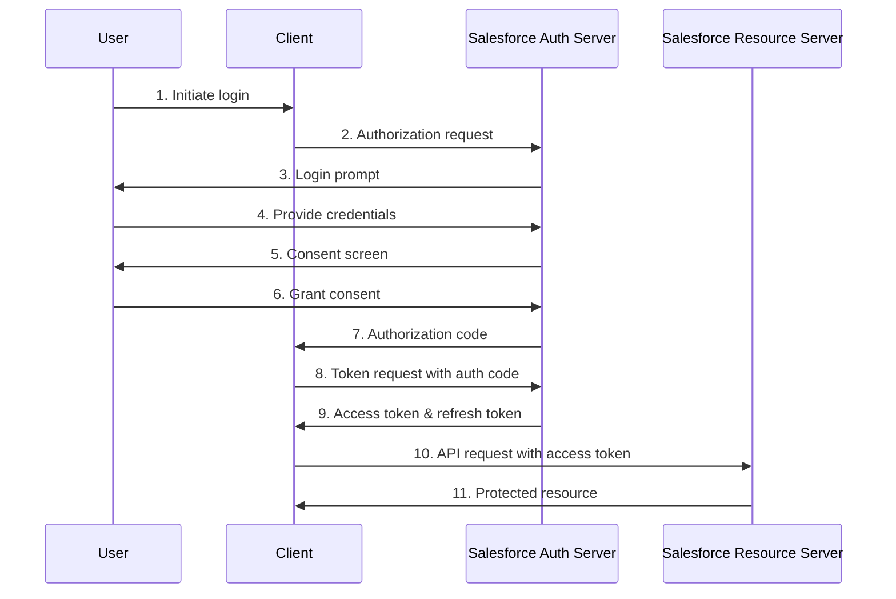
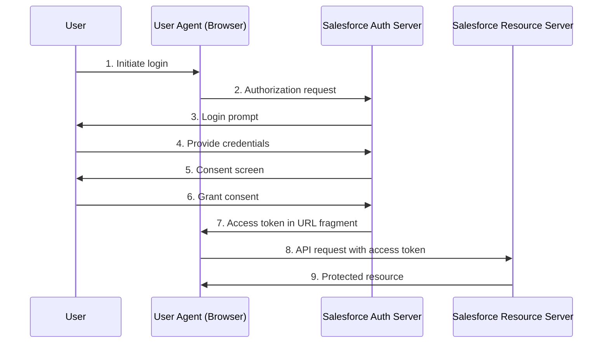
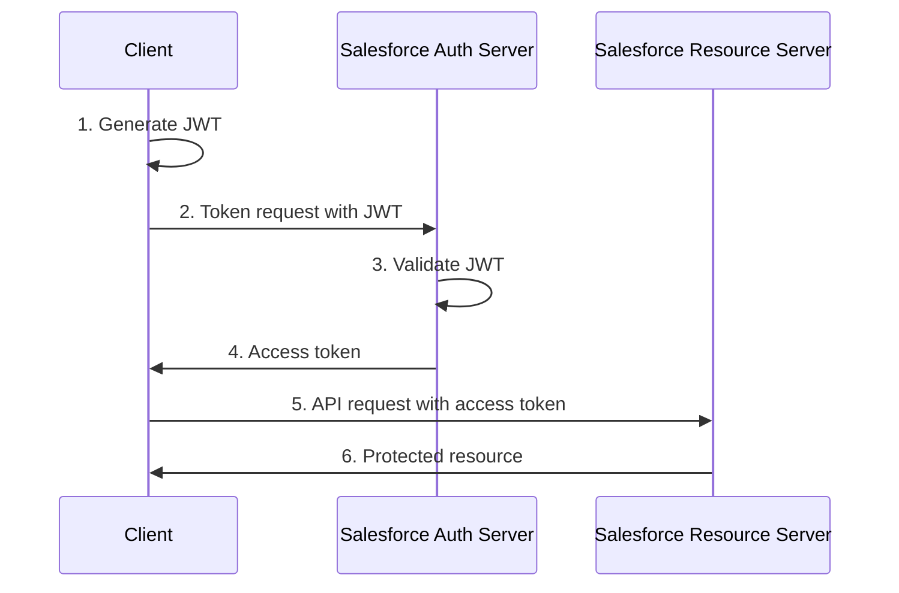
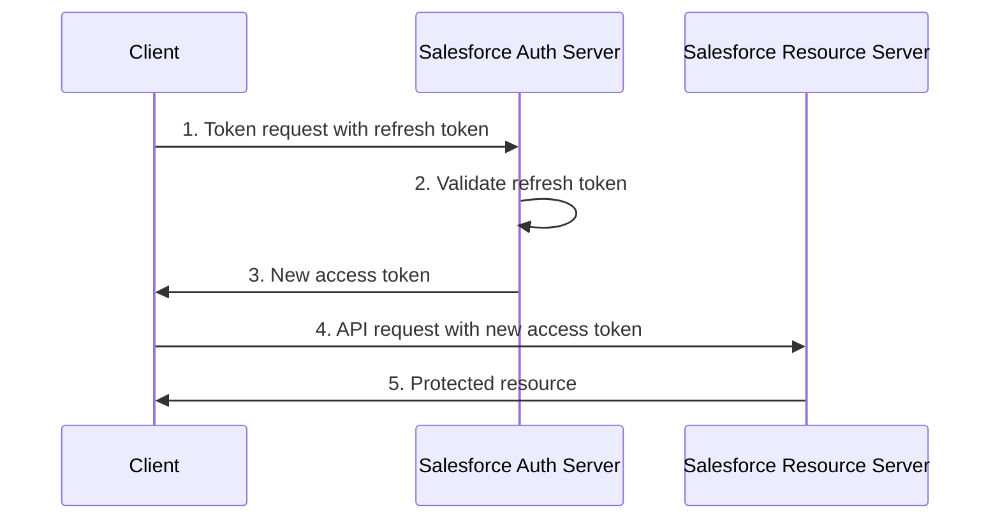
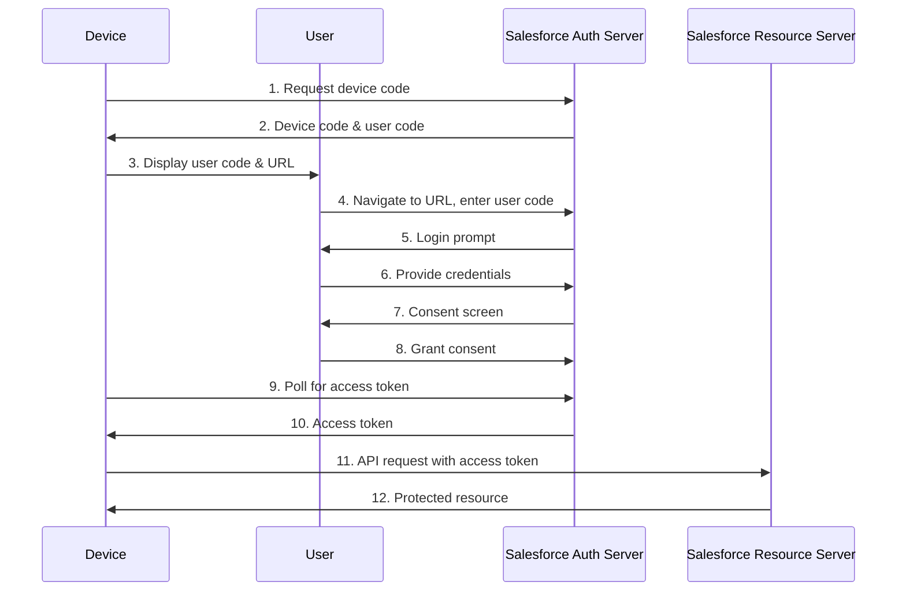
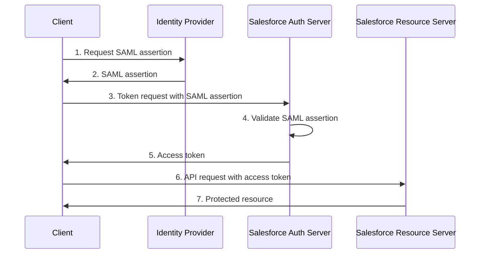
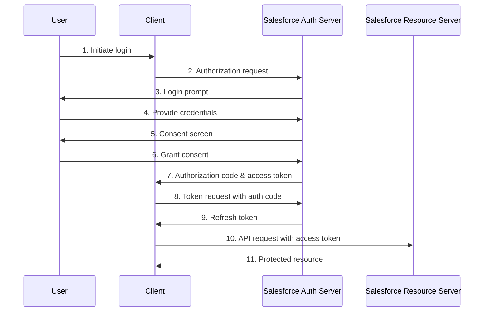
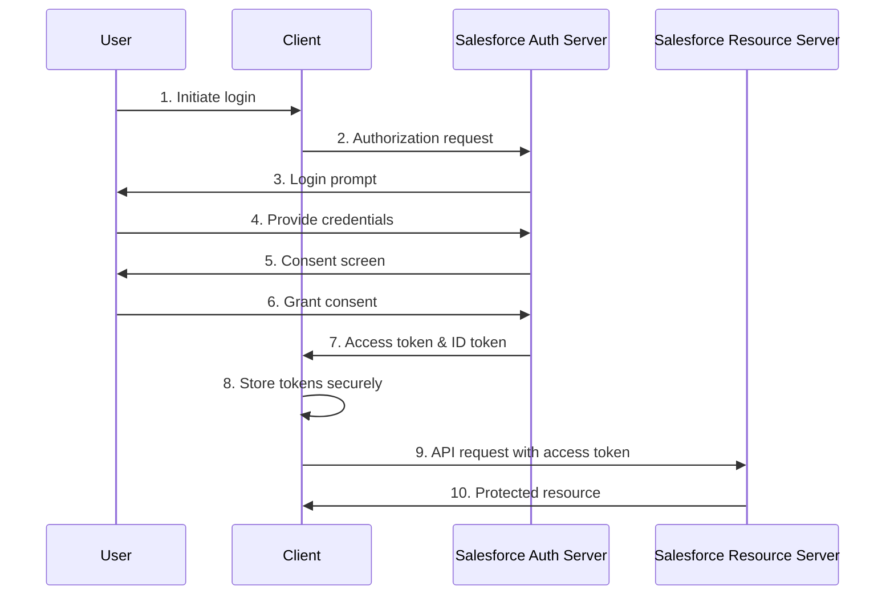
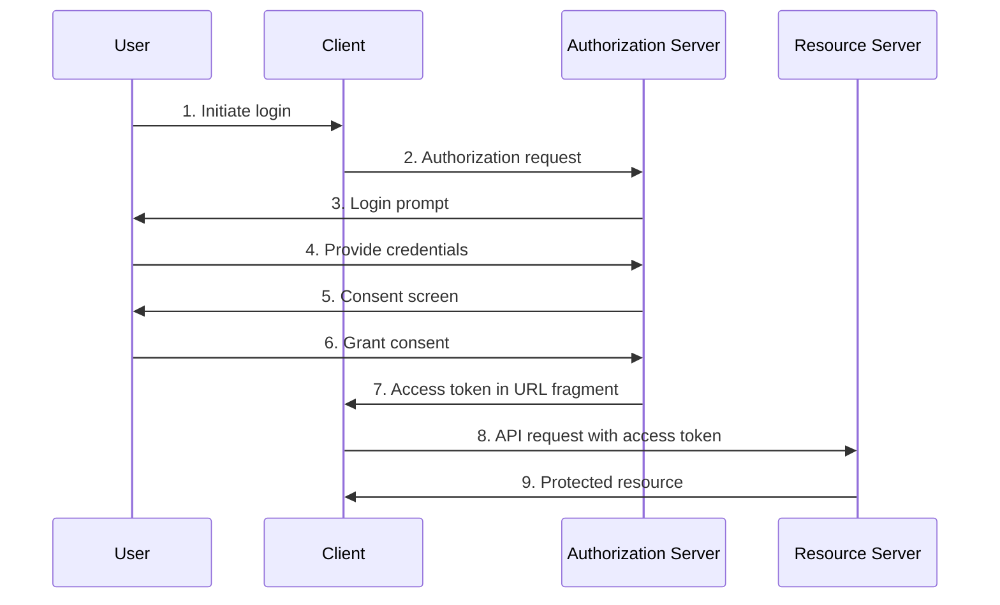
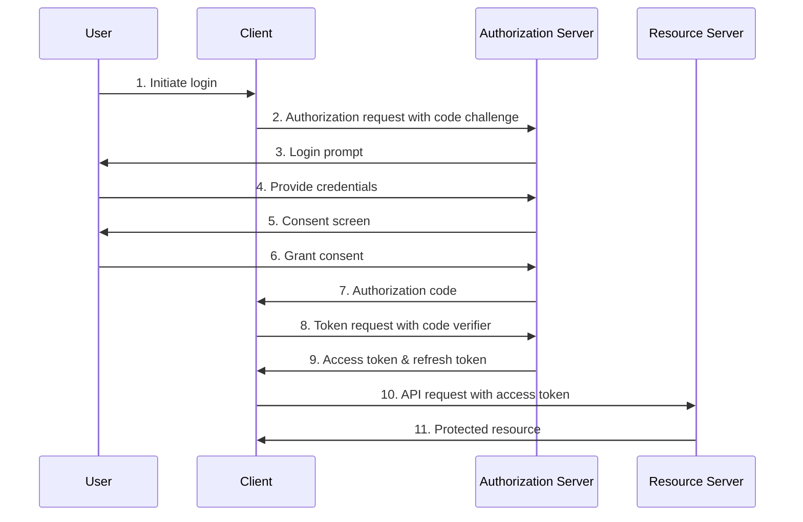

Salesforce offers a comprehensive Identity and Access Management (IAM) service known as Salesforce Customer Identity. This service is designed to enhance interactions with customers and partners by providing robust identity and access management capabilities. Key features of Salesforce Customer Identity include:

*   **User Identification and Access Management:** Salesforce Customer Identity helps manage user identities and access across various applications, improving engagement with customers and partners.
*   **Authentication and Security**: The service supports multiple authentication methods, including Multi-Factor Authentication (MFA), Single Sign-On (SSO), and various protocols such as SAML, OpenID, and OAuth.
*   **User Lifecycle Management**: Salesforce IAM includes user provisioning and de-provisioning, ensuring that access is granted appropriately as users join, move within, or leave the organization.
*   **Identity Governance**: It provides tools for managing access and authorization, ensuring that users have the appropriate level of access to resources.
*   **Audit and Compliance**: The service includes monitoring and reporting features to help with regulatory compliance and security audits.  
    These features make Salesforce Customer Identity a powerful tool for managing user identities and securing access to applications, both on-premises and in the cloud.

**Authentication Flows:**  
Authentication verifies the identity of a user or system.

*   Username-Password Authentication
*   Multi-Factor Authentication (MFA)
*   Single Sign-On (SSO)
*   SAML (Security Assertion Markup Language)
*   OpenID Connect

**Authorization Flows**_:_  
Authorization determines what resources an authenticated user or system can access.

*   **OAuth 2.0 Flows:**
     - Web Server Flow  
     - User-Agent Flow  
     - JWT Bearer Token Flow
     - Refresh Token Flow
     - Device Flow
     - SAML Assertion Flow
*   **Hybrid Flows**:
    - Hybrid Web Server Flow  
    - Hybrid User Agent Token Flow (formerly Hybrid App Token Flow)
*   **Server-to-Server Flows**

These flows can be used in various combinations depending on the specific use case and security requirements. For example, a user might authenticate using SSO with MFA, and then be authorized to access certain resources through an OAuth 2.0 flow.  
It's worth noting that Salesforce provides flexibility in implementing these flows, allowing organizations to choose the most appropriate methods for their security needs and user experience requirements.

**Web Server Flow:**

**User-Agent Flow:**

**JWT Bearer Token Flow:**

**Refresh Token Flow:**

**Device Flow:**

**SAML Assertion Flow:**

**Hybrid Web Server Flow:**

**Hybrid User Agent Token Flow (formerly Hybrid App Token Flow):**

**Key points about these hybrid flows:**
- **Hybrid Web Server Flow:**
This flow combines elements of both the web server flow and the user-agent flow.
It provides direct management of web sessions for hybrid apps.
The authorization server grants both an authorization code and an access token in a single response.
The client can use the authorization code to obtain a refresh token, providing better long-term access management.
- **Hybrid User Agent Token Flow:**
This flow was formerly known as the Hybrid App Token Flow.
It's designed for hybrid apps that need direct management of web sessions.
The flow returns both an access token and an ID token.
It provides a higher level of security compared to the standard user-agent flow, as tokens are not exposed in the URL.
Both of these hybrid flows offer enhanced security and flexibility for applications that combine elements of web and native apps. They allow for better session management and can provide a smoother user experience while maintaining robust security measures

The **OAuth 2.0 implicit grant type** is used in the Implicit Flow. This flow is specifically designed for public clients, such as mobile applications or pure JavaScript front-end applications, where the access token is returned immediately without an extra authorization code exchange step.
Implicit Flow
- The Implicit Flow is characterized by the following steps:
- Initiate Login: The user initiates the login process.
- Authorization Request: The client application sends an authorization request to the authorization server.
- Login Prompt: The authorization server prompts the user to log in.
- User Provides Credentials: The user provides their credentials.
- Consent Screen: The authorization server displays a consent screen to the user.
- Grant Consent: The user grants consent.
- Access Token in URL Fragment: The authorization server redirects the user back to the client application with an access token in the URL fragment.
- API Request with Access Token: The client application uses the access token to make API requests to the resource server.
- Protected Resource: The resource server returns the protected resource to the client application.

**Non-Implicit Type: Authorization Code Flow with PKCE**
The non-implicit type that is recommended as a replacement for the implicit grant type is the Authorization Code Flow with **PKCE (Proof Key for Code Exchange)**. This flow is more secure and is recommended for public clients, including single-page applications (SPAs) and native apps.
The Authorization Code Flow with PKCE involves the following steps:
* Initiate Login: The user initiates the login process.
* Authorization Request with Code Challenge: The client application sends an authorization request to the authorization server, including a code challenge.
* Login Prompt: The authorization server prompts the user to log in.
* User Provides Credentials: The user provides their credentials.
* Consent Screen: The authorization server displays a consent screen to the user.
* Grant Consent: The user grants consent.
* Authorization Code: The authorization server redirects the user back to the client application with an authorization code.
* Token Request with Code Verifier: The client application sends a token request to the authorization server, including the code verifier.
* Access Token & Refresh Token: The authorization server returns an access token and a refresh token to the client application.
* API Request with Access Token: The client application uses the access token to make API requests to the resource server.
* Protected Resource: The resource server returns the protected resource to the client application.

In summary, the Implicit Flow is used for public clients where the access token is returned directly, but it is no longer recommended due to security concerns. The Authorization Code Flow with PKCE is the preferred alternative, providing enhanced security by including an additional step of exchanging an authorization code for tokens.

The traditional **User-Agent Flow** does not use PKCE. It typically uses the OAuth 2.0 implicit grant type, which has some security vulnerabilities .
Due to security issues with the User-Agent Flow, it is recommended to use the Authorization Code Flow with Proof Key for Code Exchange (PKCE) instead .
The transition from User-Agent Flow to Authorization Code Flow with PKCE is considered an enhancement in security, especially for mobile and desktop applications 
PKCE was introduced to address the security vulnerabilities in the implicit grant type used by the User-Agent Flow .
Starting with **Salesforce Mobile SDK 11.0**, the default authentication on both iOS and Android platforms uses the OAuth 2.0 Web Server Flow with PKCE for increased security, replacing the previous User-Agent Flow .
While it's possible to continue using the User-Agent Flow in newer versions of the Salesforce Mobile SDK, it's not recommended due to security concerns .
In summary, **the User-Agent Flow itself does not use PKCE**. Instead, the recommendation is to transition from the User-Agent Flow to the Authorization Code Flow with PKCE for improved security, especially in mobile and desktop applications. This transition represents a shift from the implicit grant type to a more secure authorization code grant type with the added protection of PKCE.

There are several technical reasons **why the Authorization Code flow is preferred over the Implicit flow:**
* **Security of Access Token:**
In the Authorization Code flow, the access token is not exposed in the browser's URL or history, reducing the risk of token leakage .
**The Implicit flow passes the access token directly in the URL fragment, making it more vulnerable to interception.**
* **Client Authentication:**
    - **The Authorization Code flow allows for client authentication using a client secret**, which is not possible with the Implicit flow .
This additional layer of security helps prevent unauthorized clients from obtaining access tokens.
* **Refresh Tokens:**
      -   **The Authorization Code flow can return refresh tokens**, allowing for longer sessions and better user experience .
The Implicit flow typically does not provide refresh tokens due to security concerns.
Token Storage:
    -    **In the Authorization Code flow**, tokens can be securely stored on the server-side, reducing the risk of client-side exposure .
* **PKCE Support:**
    -     **The Authorization Code flow can be enhanced with Proof Key for Code Exchange (PKCE)**, which adds an extra layer of security for public clients .
PKCE helps mitigate authorization code interception attacks, which is particularly important for mobile and single-page applications.
Separation of Concerns:
    -     **The Authorization Code flow separates the authentication and token issuance steps**, allowing for better security practices and easier implementation of additional security measures .

* **Compliance with Best Practices:**
Current security best practices recommend using the Authorization Code flow with PKCE instead of the Implicit flow, especially for single-page applications and mobile apps .
    - **Reduced Token Exposure:**
In the Authorization Code flow, the access token is exchanged server-side, reducing exposure to potentially malicious client-side scripts .
     - **Better Support for Mobile and Desktop Apps:**
The Authorization Code flow with PKCE is better suited for mobile and desktop applications, where secure storage of client secrets may be challenging .
These technical reasons make the Authorization Code flow (especially when combined with PKCE) a more secure and flexible choice compared to the Implicit flow for most modern application scenarios.

**Overview of MFA, SSO, SAML, and OpenID**
    - **Multi-Factor Authentication (MFA)**
Multi-Factor Authentication (MFA) is a security mechanism that requires users to provide two or more verification factors to gain access to a resource such as an application, online account, or VPN. MFA combines two or more independent credentials: what the user knows (password), what the user has (security token), and what the user is (biometric verification).
    - **Single Sign-On (SSO)**
Single Sign-On (SSO) is an authentication process that allows a user to access multiple applications with one set of login credentials. This improves user experience by reducing the number of times a user has to log in and enhances security by centralizing authentication.
    - **Security Assertion Markup Language (SAML)**
    SAML is an open standard for exchanging authentication and authorization data between parties, specifically between an identity provider (IdP) and a service provider (SP). SAML is primarily used for enterprise and government applications to provide SSO access to web applications. It uses XML for its identity data format and supports HTTP or SOAP for data transport mechanisms.
        - **Key Points about SAML:**
    # Mature Technology: Established in 2005, widely trusted.
    # XML-Based: Uses XML for data interchange.
    # Enterprise Use: Commonly used in enterprise and government settings.
    # SSO: Provides SSO capabilities.
    # Federated Identity: Supports identity federation, allowing trust between different organizations' authentication systems.

    - **OpenID Connect (OIDC)**
    OpenID Connect (OIDC) is an authentication protocol built on top of OAuth 2.0. It allows clients to verify the identity of the end-user based on the authentication performed by an authorization server, as well as to obtain basic profile information about the end-user in an interoperable and REST-like manner.
    - Key Points about OIDC:
        # Modern Protocol: Developed in 2014, newer than SAML.
        # JSON-Based: Uses JSON for data interchange.
        # OAuth 2.0 Foundation: Extends OAuth 2.0 with an identity layer.
        # Mobile and Web Apps: Ideal for mobile and single-page applications.

 - **SSO: Provides SSO capabilities.**
    # Lightweight: Easier to implement compared to SAML, especially for developers.
    # Comparison: SAML vs. OpenID Connect (OIDC)
    # Similarities:
    # Both enable SSO.
    # Both are secure, well-documented, and mature.
    # Both involve an identity provider (IdP) and service provider (SP).

* **Differences:**
    # Data Format: SAML uses XML, while OIDC uses JSON.
    # Implementation Complexity: OIDC is generally simpler to implement due to the absence of XML handling.
    # Use Cases: SAML is more feature-rich and suited for enterprise environments, while OIDC is more lightweight and suitable for mobile and web applications.
    # Decentralization: OIDC supports decentralized authentication, while SAML typically involves centralized identity management.
    # API Workloads: OIDC is designed to secure APIs, whereas SAML is more focused on web-based SSO.

* **Use Cases**
    - **SAML:**
Enterprise and government applications.
Scenarios requiring extensive identity data exchange.
Environments where XML handling is not an issue.
    - **OIDC:**
Consumer applications, especially mobile and single-page web apps.
Scenarios requiring lightweight and easy-to-implement authentication.
Applications needing to secure APIs.
    - **Conclusion**
Both SAML and OpenID Connect (OIDC) serve crucial roles in identity and access management, providing SSO capabilities and enhancing security. The choice between them depends on specific use cases, technical requirements, and the environment in which they will be deployed. For enterprise-level, feature-rich identity management, SAML remains a strong choice. For modern, lightweight, and developer-friendly implementations, especially in mobile and web applications, OIDC is often preferred.
